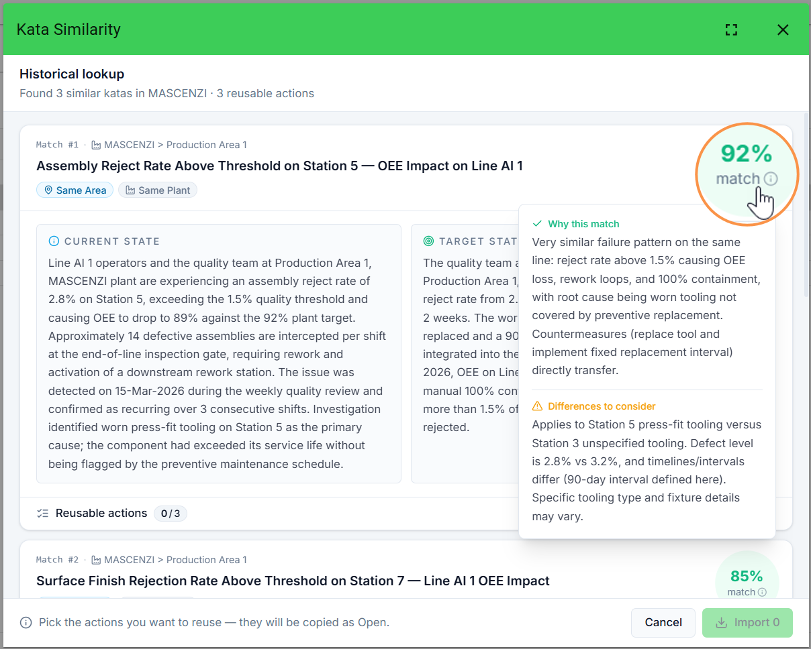
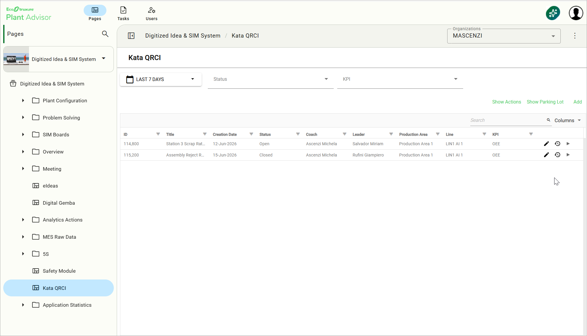
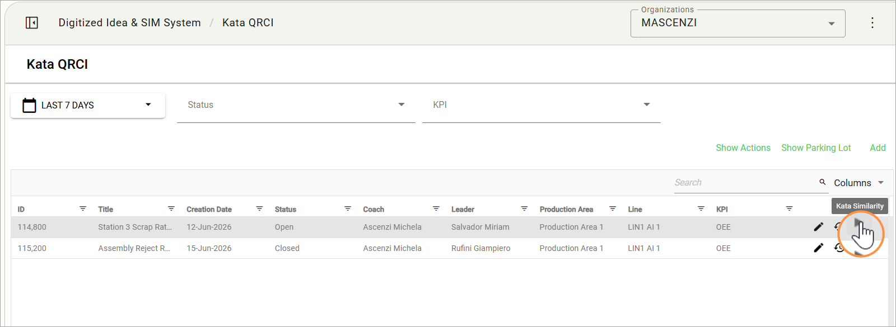
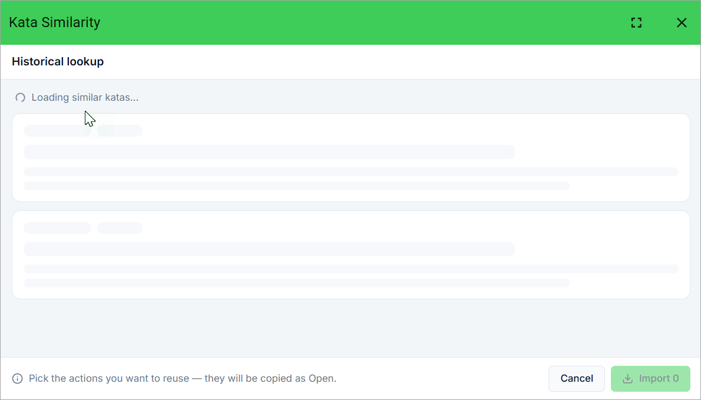
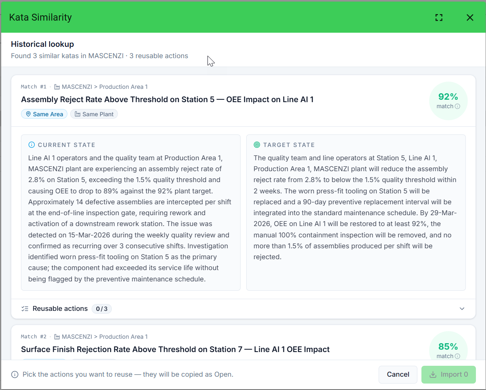
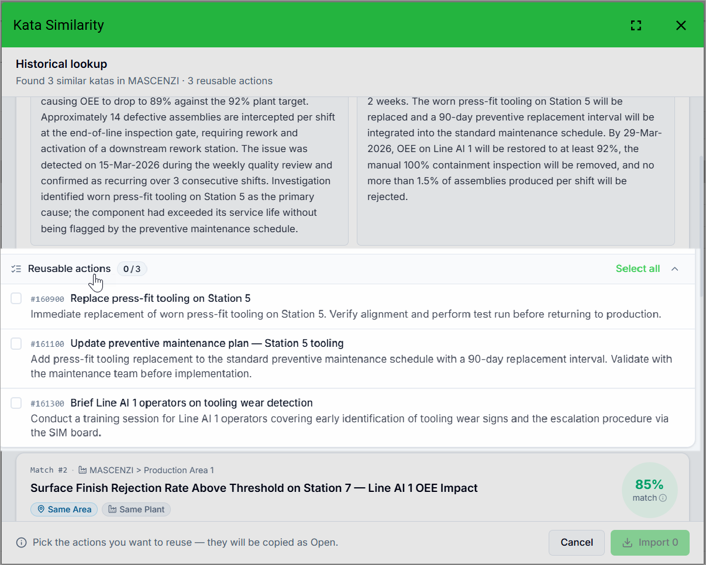
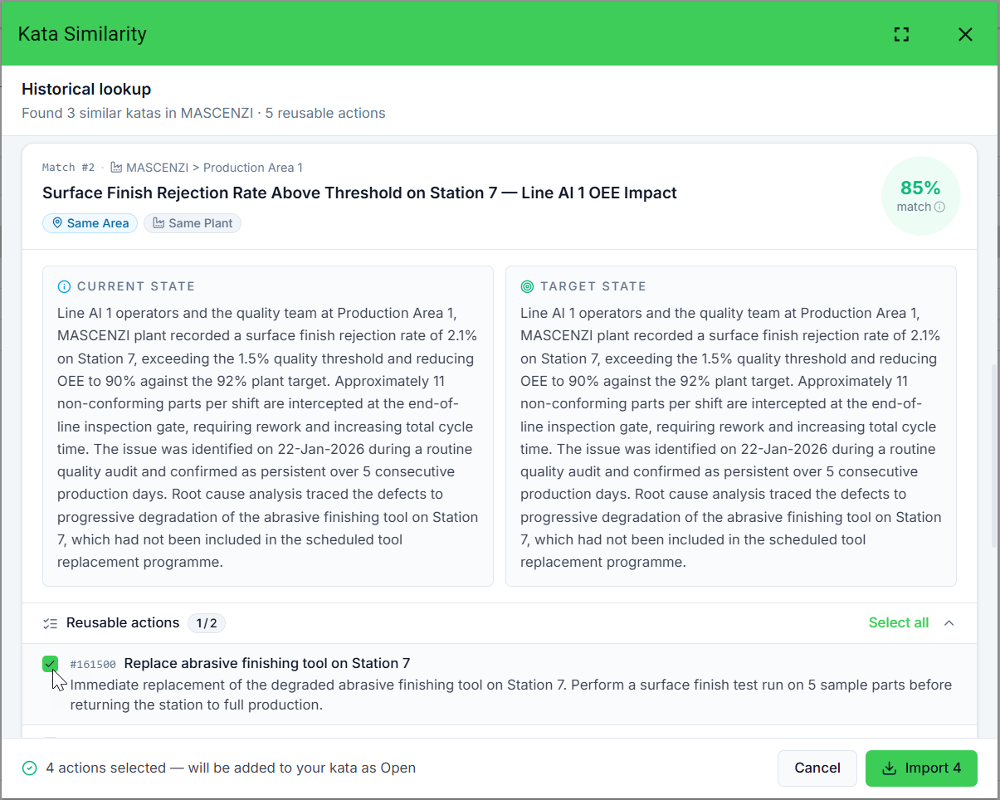
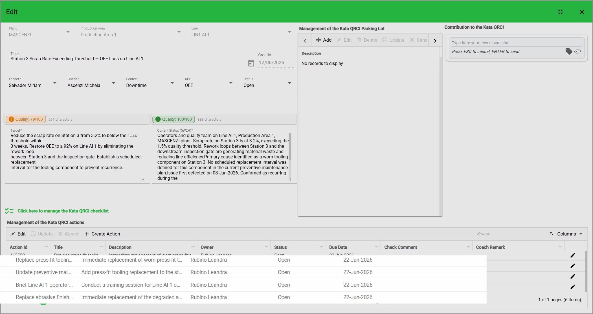

# 3. Historical Lookup

### Overview

**Historical Lookup** is an AI feature that, starting from the Kata QRCI you are currently working on, searches the closed Katas of the same Plant and returns the most similar ones. For each historical Kata the user can review the AI explanation of the match and import — selectively — the actions that were used to solve the past problem, accelerating the response to recurring issues.

<figure><figcaption></figcaption></figure>

## When to use it

* Whenever a problem on the shop floor feels familiar but the team cannot remember when, where, and how it was solved before.
* Before saving a new Kata, to check whether the same problem has already been tackled and avoid duplicating effort.
* During root-cause analysis, to read how peers formulated the Current State and the Target State for a comparable case.

## Prerequisites

* The current Kata must have a Plant defined: Historical Lookup is enabled only when the Plant is set.
* There must be at least one Kata with status **Closed** in the search perimeter for the AI to find any match.
* The user must have read access to the historical Katas in the search perimeter.

## How to use it



### Open the Kata Dashboard

* Open the **Kata Dashboard** in DISS.

<figure><figcaption></figcaption></figure>



### Launch the Historical Lookup

* In the **Kata** column, click the **Kata Similarity icon** next to the Open Kata you are working on.

<figure><figcaption></figcaption></figure>



### Wait for the AI search to complete

* The **AI Historical Lookup** modal opens and the search starts automatically — no additional input is required. Wait for the loading message ("Loading similar Katas…") to complete.

<figure><figcaption></figcaption></figure>



### Review the similar Katas

* Review the up-to-5 closed Katas returned, sorted by similarity score descending.

<figure><figcaption></figcaption></figure>



### Analyse each match in detail

* For each match, expand the **AI Analysis** accordion to read "**Why this matches**" and "**Differences to consider**".

<figure><figcaption></figcaption></figure>



## Selective Action Copy

Each historical match has a **Reusable actions** toggle. When expanded, the actions of that Kata are loaded and a checkbox appears next to each action. You can:

* Select individual actions one by one;
* Use **Select All / Deselect All** inside one historical Kata;
* Combine selections from multiple Katas in the same session — the total count is always visible.

When at least one action is selected, the **Import N Actions** button appears at the bottom. Click it to copy the selected actions into the current Kata. For each imported action:

* **Title**, **description** are copied from the source;&#x20;
* Status is reset to Open;&#x20;
* Due date by default today + 7 days, the new owner picks a fresh deadline.

On success, the modal closes automatically, a confirmation message appears, and the Actions table of the current Kata refreshes to show the new records.



### Load historical actions

* In one of the matches, click **Reusable actions** to load that Kata's historical actions.

<figure><figcaption></figcaption></figure>



### Select the actions to import

* Use the checkboxes to pick individual actions, or use **Select All / Deselect All** to act on the entire Kata.

<figure><figcaption></figcaption></figure>



### Combine selections from multiple Katas

* Optionally repeat for other matches: selection persists across multiple Katas in the same session.

<figure><figcaption></figcaption></figure>



### Import the selected actions

* Click **Import N Actions** at the bottom of the modal.

<figure><figcaption></figcaption></figure>



### Confirm and check the imported actions

* The modal closes, a confirmation appears, and the current Kata's Actions table refreshes with the new records (Status = Open, Due Date = Current Date).

<figure><figcaption></figcaption></figure>



## Reading the result

| Field                   | Description                                                                                                                                                                                  |
| ----------------------- | -------------------------------------------------------------------------------------------------------------------------------------------------------------------------------------------- |
| Similarity score        | A percentage (0–100) indicating how closely the closed Kata matches the open one. Scores above 70 indicate strong thematic overlap; scores below 40 are weak matches shown for completeness. |
| Why this matches        | A concise AI-generated explanation of the shared elements between the two Katas.                                                                                                             |
| Differences to consider | A brief summary of what distinguishes the historical case from the current one.                                                                                                              |
| Reusable actions        | The full list of actions from the historical Kata, ready for selective import.                                                                                                               |

## Tips & known limits


* By default Historical Lookup searches only inside the current Plant. When multi-plant scope is enabled, the source Plant is clearly labelled on every result.
* Only **Closed** Katas are considered; in-progress Katas are excluded.
* Identical or near-identical Katas are not hidden — they appear with very high similarity so you can decide whether to import their actions.
* Imported actions always start fresh (Status = Open, Due date = by default today + 7 days): the new owner takes ownership of timing.
* Filters on Area, Line, Source, KPI are NOT hard filters — the AI uses them as semantic context, which means a relevant match from a different Line may still be proposed.

