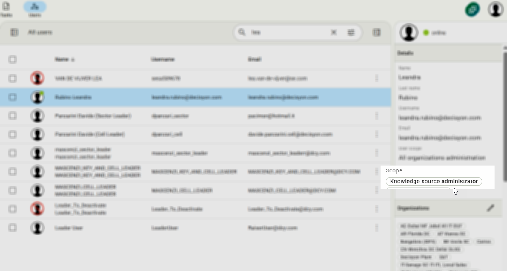
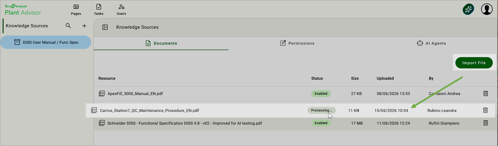
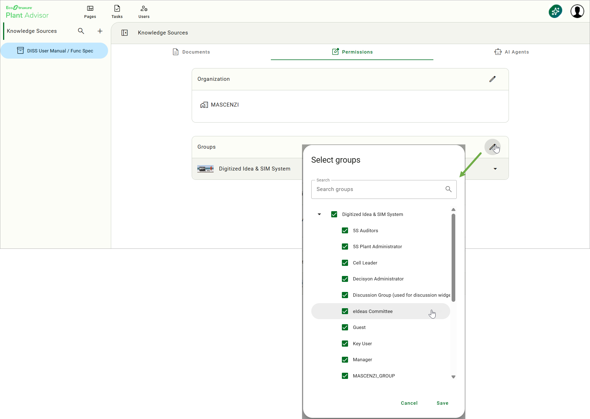
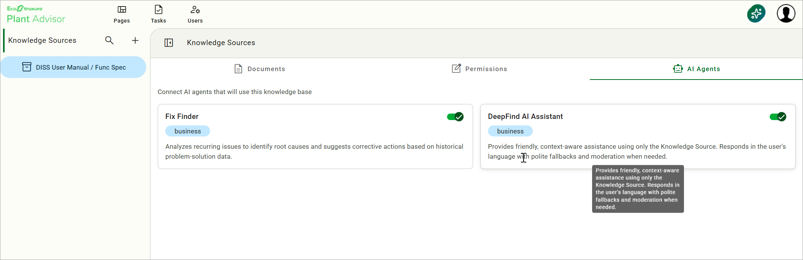
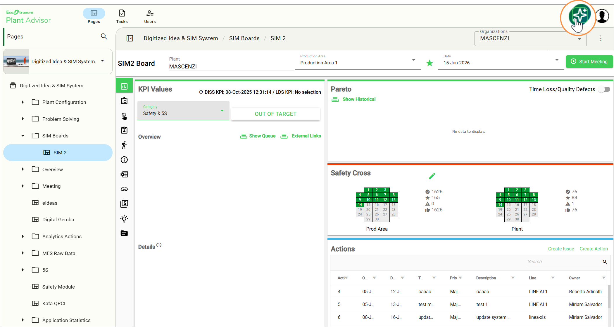
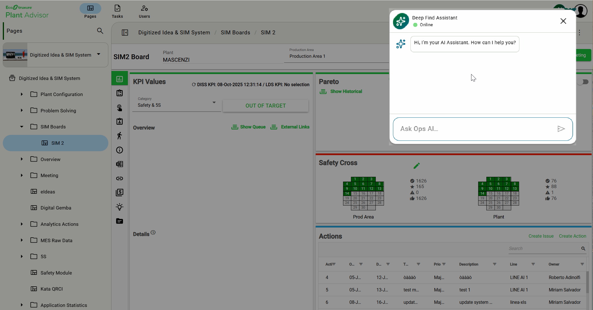
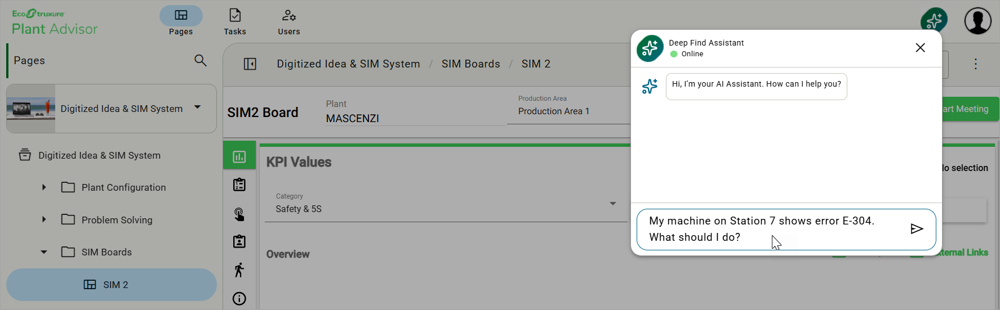
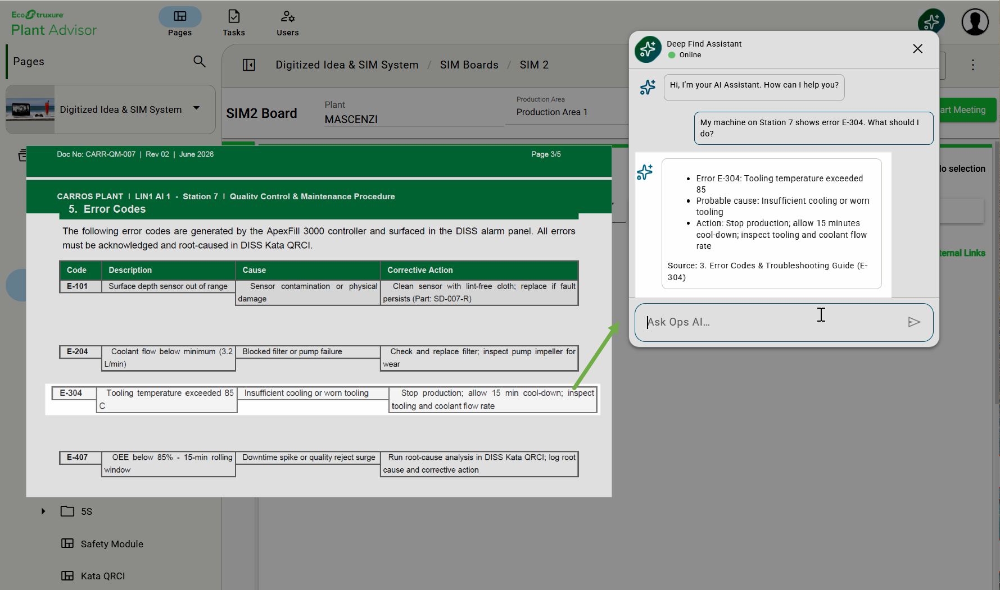

# 4. DeepFind

### Overview

DeepFind is an AI chatbot embedded in DISS that lets users query a configured Knowledge Source — a repository of plant manuals, procedures, FAQs, policies, reports — using natural language. DeepFind scans the documents that have been uploaded and synthesises an answer grounded on their content. Multiple documents can be attached to the same conversation to provide a richer context for the AI.

<figure><figcaption></figcaption></figure>

## When to use it

* Looking up the procedure for a specific intervention on a piece of equipment
* Verifying the prerequisites or steps of a quality or safety policy
* Identifying an error code that appeared on a machine and finding the recommended troubleshooting and corrective actions
* Finding the right paragraph in a long technical manual during a Kata investigation

## Prerequisites

* A Knowledge Source must be configured for your plant in DISS
* The relevant documents (manuals, procedures, FAQs, error-code references) must have been uploaded to the Knowledge Source
* DeepFind must be explicitly enabled on that Knowledge Source


If DeepFind is not visible in your DISS toolbar, contact your DISS administrator to verify that a Knowledge Source with DeepFind enabled has been configured for your plant.


## How to use it



### Configure the Knowledge Source

This step is performed by a user with the **Knowledge Source administrator** scope and must be completed before end users can query DeepFind.

<figure><figcaption></figcaption></figure>

Click your user avatar in the top-right corner and select **Knowledge Sources** from the dropdown menu. In the left panel, click **+** to open the Create knowledge source dialog. Enter a descriptive name and click **Create**.

With the Knowledge Source selected, go to the **Documents** tab and click **Import File** to upload the relevant documents (PDF or compatible format). Repeat for each additional file.

<figure><figcaption></figcaption></figure>

In the **Permissions** tab, assign the organisations and user groups allowed to query this Knowledge Source.

<figure><figcaption></figcaption></figure>

In the **AI Agents** tab, enable the **DeepFind AI Assistant** toggle to connect this Knowledge Source to DeepFind.

<figure><figcaption></figcaption></figure>



### Open DeepFind

Locate the **DeepFind Assistant** icon in the DISS toolbar and click it to open the chat interface.

<figure><figcaption></figcaption></figure>

<figure><figcaption></figcaption></figure>



### Ask a question

Type your question in natural language — full sentences work better than keyword searches. For troubleshooting, include the error code and a short description of the symptom.

<figure><figcaption></figcaption></figure>



### Read the answer and follow up

Read the synthesised answer. DeepFind cites the source document and section at the bottom of each response, so you can verify where the information comes from. If needed, ask a follow-up question to refine or expand the answer.

<figure><figcaption></figcaption></figure>



## Reading the result

DeepFind synthesises one answer based on the most relevant passages found in the configured Knowledge Source and in any documents attached to the conversation. The answer respects the access policies of the underlying documents: a user only sees information from documents they are allowed to access.

When DeepFind cannot answer based on the available material, it returns: _"I'm sorry, but I can't help with that because it's outside the scope of my knowledge."_ This means that no relevant document was found, not that the topic does not exist.

## Tips & known limits


* Ask one question at a time — compound questions tend to be answered partially
* If the answer is incomplete, rephrase with different keywords or be more specific about the equipment, process, or error code
* If the question is in scope but no answer is found, ask your DISS administrator to verify that the relevant document is uploaded and DeepFind is enabled on that Knowledge Source
* DeepFind does not invent content: it only references material present in the configured Knowledge Source or in the attached documents

