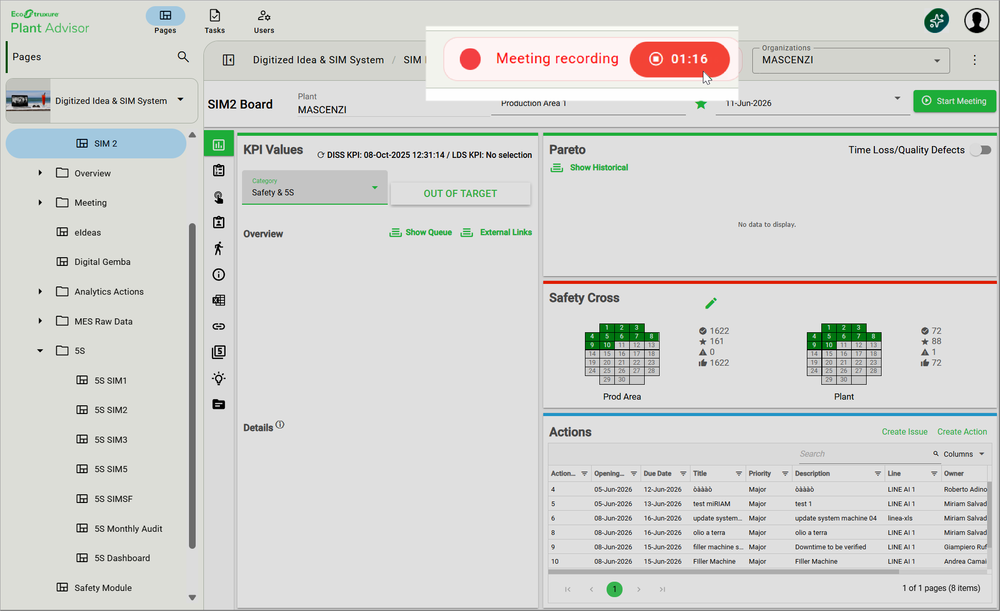
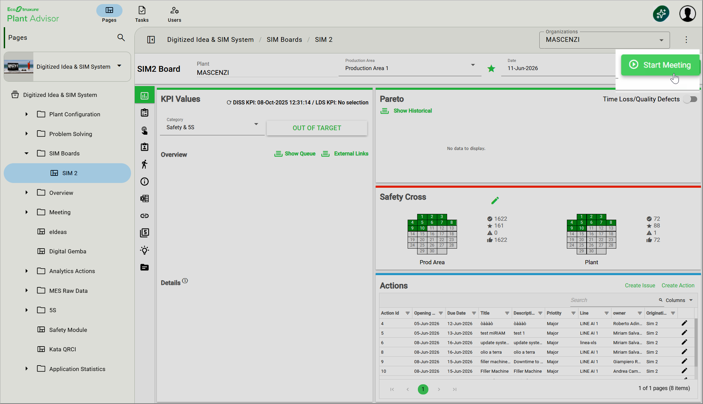
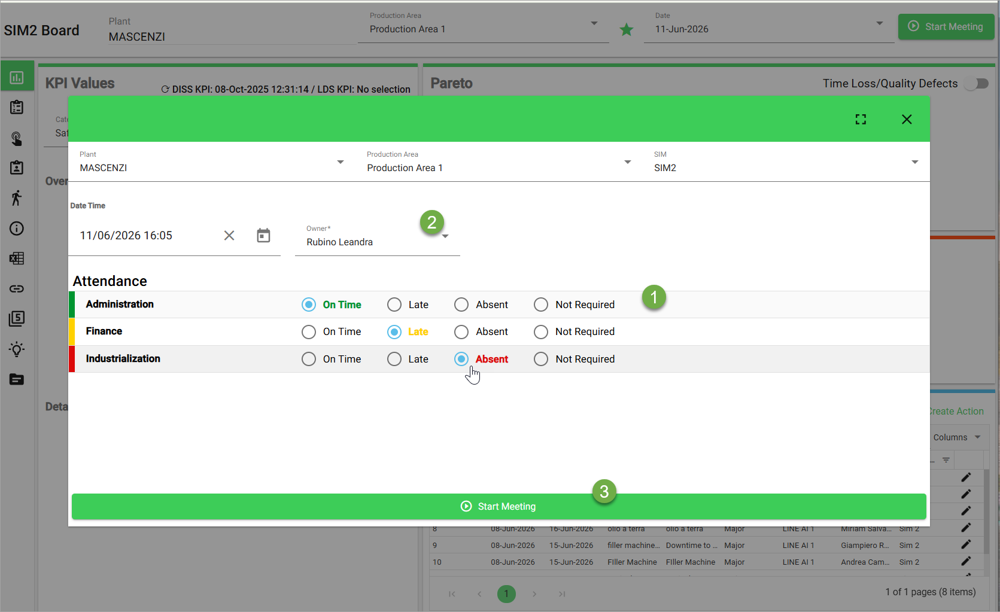
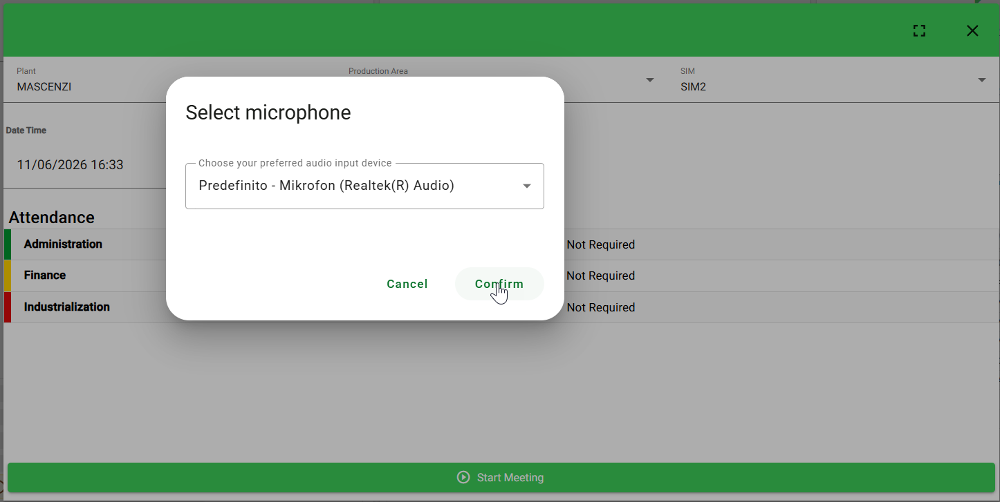
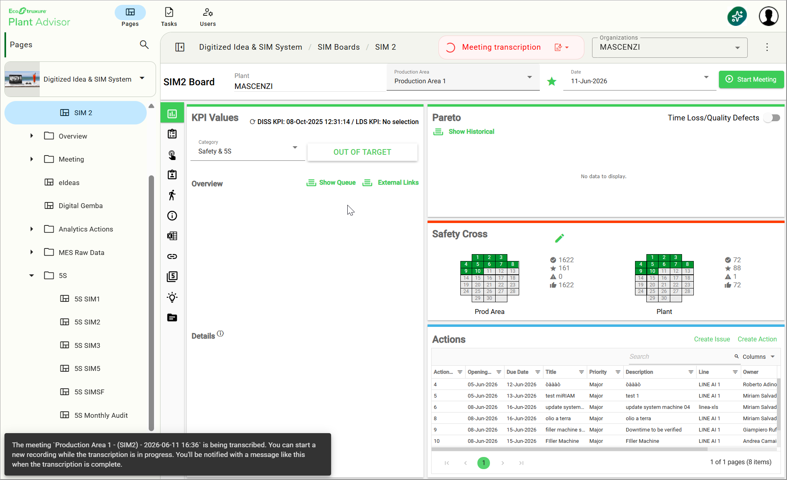
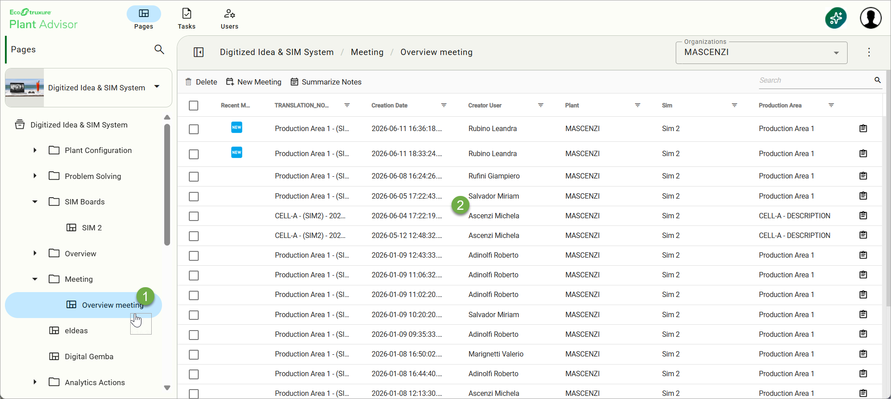
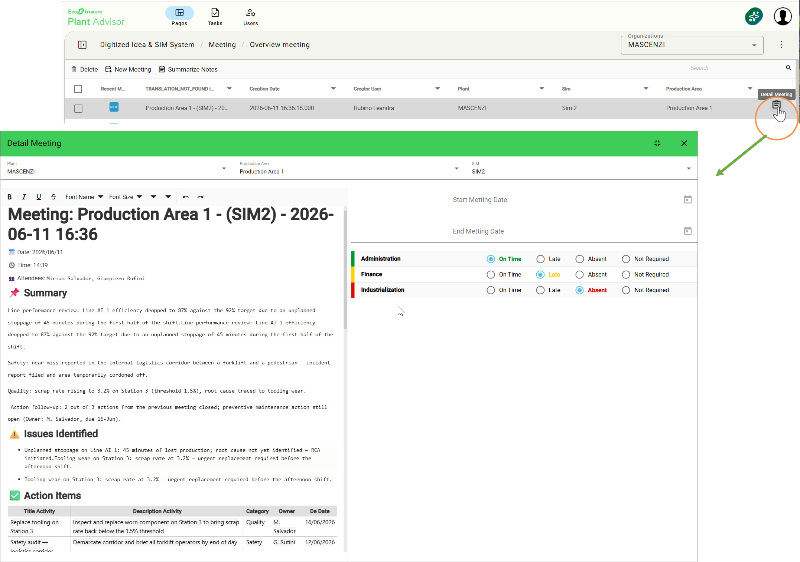
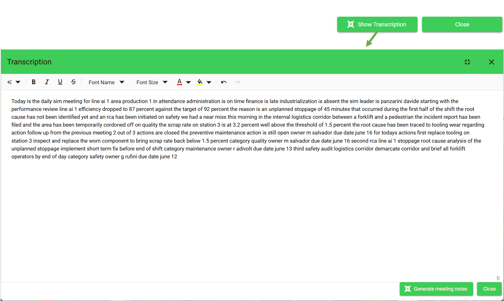

# 5. Meeting Sense

### Overview

**Meeting Sense** is the meeting recording and transcription capability embedded in DISS. It transforms the spoken dialogue of a SIM meeting into structured, digital data: a textual transcription, an executive summary, the issues raised, and a list of proposed actions ready to be added to the SIM action plan. The session is automatically contextualised with the metadata of the SIM Board it was launched from (Plant, SIM level, Production Area) so that every output is already linked to the right operational scope.

<figure><figcaption></figcaption></figure>

## When to use it

* During a daily SIM 2 meeting where a team discusses problems, root causes, and corrective actions and wants every outcome traceable in DISS without manual note-taking.
* Whenever the SIM Leader wants the conversation recorded in full so that nothing is lost between the discussion and the action plan.
* When the team needs both an attendance record and a structured set of actions ready to be assigned in one go at the end of the meeting.

## Prerequisites

* The SIM Board on which the meeting is opened must be a **SIM 2** Board (Meeting Sense is enabled at this SIM level).
* A working microphone must be available on the device used to start the meeting.
* Attendance roles must be configured for the SIM 2 Board — accessible at **Plant Configuration → Attendance → SIM 2 Attendance Configuration.**
* The user must have permission to start a meeting on the SIM Board in scope.

## How to use it



### Open the SIM Board and start the meeting

* Navigate to the SIM Board where the meeting takes place (**Digitized Idea & SIM System → SIM Boards → SIM 2**). The Plant, Production Area, and Date are pre-filled.&#x20;
* Click **Start Meeting** in the top-right corner to open the meeting initialisation dialog.

<figure><figcaption></figcaption></figure>



### Initialise attendance and SIM Leader

In the initialisation dialog:

* Define the status of each participant (**On time, Late, Absent**, or **Not Required**);
* Assign the **SIM Leader** (by default the current user, changeable via dropdown);
* Click **Start Meeting** to proceed.

<figure><figcaption></figcaption></figure>



### Select the audio input and start recording

* Choose the desired microphone from the list of available audio inputs and confirm. If no microphone is detected, an error message is displayed and the recording cannot be started.

<figure><figcaption></figcaption></figure>



### Conduct the meeting

Speak clearly throughout the meeting and articulate the elements needed to create actions afterwards:&#x20;

* A **short description** of the problem;
* The relevant **Category** (Safety, Quality, Delivery, Maintenance, Production, Engineering);
* The **name of the assigned person**;
* The **target** completion date.

<figure><figcaption></figcaption></figure>


A pre-defined timeout protects against meetings left open by mistake: a notification dialog appears two minutes before the timeout to give you a chance to extend or stop the session manually.




### Stop the recording

* Click the **Stop** control when the meeting is over. The system starts processing the audio in the background. While the transcription is being generated, you can move to other activities — the team does not need to wait on the meeting page.&#x20;
* A notification confirms when the transcript and AI analysis are ready.

<figure><figcaption></figcaption></figure>



### Open the meeting from the archive

* Navigate to **Meeting → Overview Meeting**.&#x20;
* The Overview Meeting page lists every recorded session in chronological order, showing title, SIM level, date, and SIM Leader.&#x20;

<figure><figcaption></figcaption></figure>

* Click on a meeting to open its detail view.

<figure><figcaption></figcaption></figure>



### Review and edit the transcript

* Click **Show Transcription** to display the verbatim text, which remains fully editable.
* Correct any misinterpretation made by the speech-to-text engine or add details that were not captured.&#x20;
* When the transcript is updated, click **Generate meeting notes** to refresh the AI summary.

<figure><figcaption></figcaption></figure>



## Reading the result

| Block                | Description                                                                                                                   |
| -------------------- | ----------------------------------------------------------------------------------------------------------------------------- |
| Summary              | A narrative overview of the meeting discussion generated by the AI, covering the main topics addressed.                       |
| Identified Issues    | A structured list of problems and anomalies surfaced during the meeting, extracted by the AI from the recorded conversation.  |
| AI-Suggested Actions | Action proposals generated automatically from the dialogue, each with an inferred description, category, owner, and due date. |
| Attendance Record    | The attendance list compiled at the start of the meeting, with the status set for each participant.                           |
| Duration             | The total duration of the recorded meeting session.                                                                           |

## Tips & known limits


* Speak clearly and avoid overlapping voices: AI extraction quality scales with audio clarity.
* Mention names and dates with precision — "John, by Friday" produces a stronger AI suggestion than implicit references such as "him, by end of week".
* Category and Owner are mandatory for action creation: an action proposed without those values must be completed in the validation table before it can be saved.
* Meeting Sense is a recording assistant: the SIM Leader is always in control — actions become part of the SIM plan only after explicit validation, and the transcript can be edited and re-summarised before any action is created.

