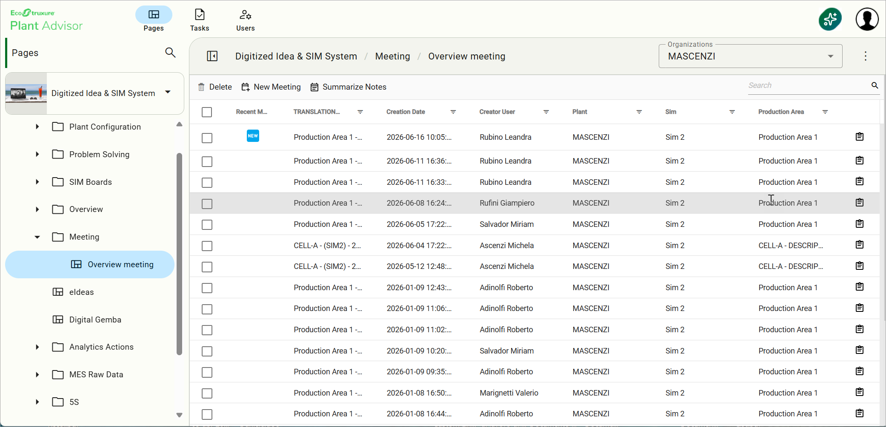
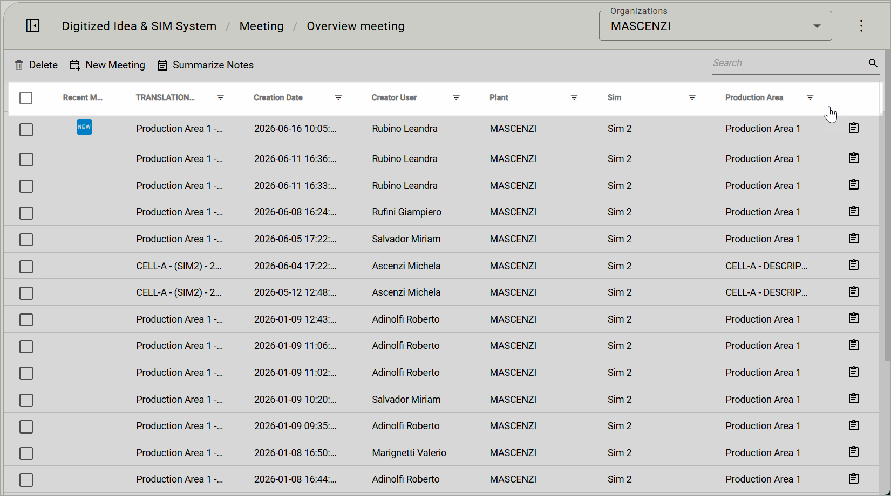
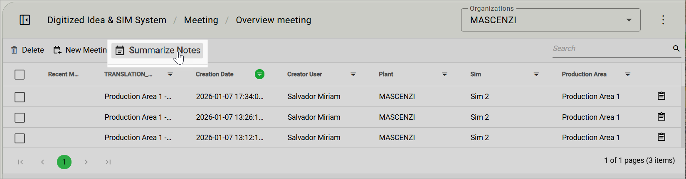
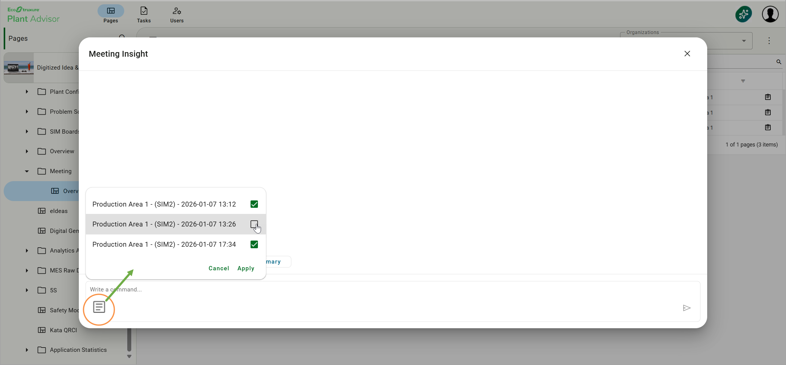
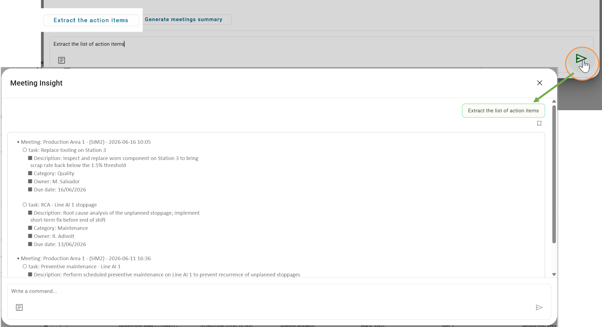
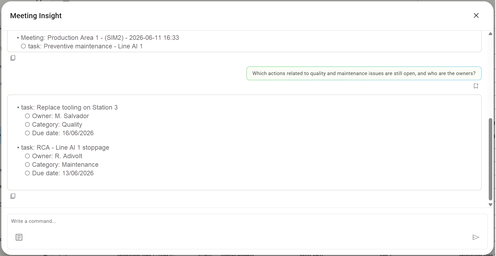
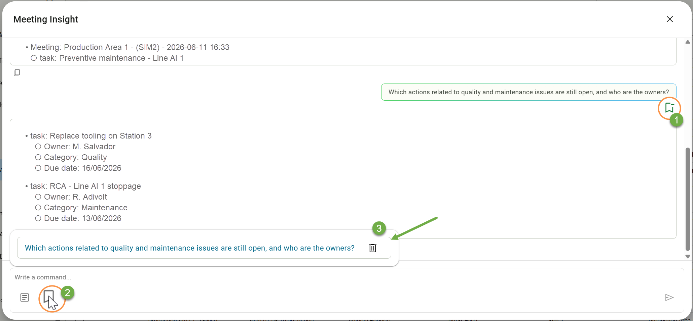

# Meeting Insight

### Overview

Meeting Insight is an AI agent that works on top of the meetings already captured by MeetingSense. While MeetingSense focuses on a single recording, Meeting Insight analyses multiple meeting transcripts simultaneously to surface patterns, recurring issues, and aggregated action items across the whole archive. It transforms a stream of individual SIM minutes into operational intelligence at the plant or area level.

## When to use it

* To answer "What problems keep coming back?" — Meeting Insight identifies recurring themes across SIM meetings over a chosen period
* To produce a consolidated list of action items from many meetings (for example, all SIM 1 meetings in the past month) without opening them one by one
* To extract trends and patterns across different production dates and production areas, supporting management reviews and continuous-improvement steering
* To investigate a topic across the meeting archive using natural-language questions in any supported language

## Prerequisites

* At least one meeting transcription produced by MeetingSense must exist in the DISS environment
* The user must have access to the Overview Meeting archive
* The user must have read access to the meetings included in the analysis

## How to use it



### Navigate to the Overview Meeting archive

Navigate to the **Overview Meeting** archive in DISS.

<figure><figcaption></figcaption></figure>



### Filter the meeting archive

Use date or organisational level filters to isolate the meetings relevant to your analysis scope.

<figure><figcaption></figcaption></figure>



### Select the meetings to analyse

Select multiple meetings using the checkboxes on the left of each row to define the analysis dataset.

<figure><figcaption></figcaption></figure>



### Launch Meeting Insight

Click **Summarize Notes** to launch the Insight Agent on the selected meetings. The agent opens a dialog window where you can interact with the combined dataset of all selected transcripts.

<figure><figcaption></figcaption></figure>



### Manage the active selection

Use the side panel to view or deselect specific meetings without closing the dialog, keeping full control over the analysis scope.

<figure><figcaption></figcaption></figure>



### Extract the list of action items

Click **Extract list of action items** to aggregate all action items across the selected sessions in a single list.

<figure><figcaption></figcaption></figure>



### Ask natural-language questions

Ask natural-language questions in the input field to locate specific operational details — root causes, recurring barriers, owners — across the transcripts.

<figure><figcaption></figcaption></figure>



### Export and bookmark results

Bookmark frequently used queries for faster reuse, and copy the generated summaries or action lists to external documents for reporting.

<figure><figcaption></figcaption></figure>



## Reading the result

| Output | Description |
|--------|-------------|
| Action items list | A consolidated, deduplicated list of all action items surfaced across the selected meeting sessions, showing description, inferred owner, and source meeting |
| Natural-language response | A synthesised AI answer drawing on the full transcribed content of the selected meetings, with references to the source meeting and session |
| Bookmarked queries | Frequently used queries saved and reusable from the side panel, accelerating recurring analyses such as weekly trend checks or management reviews |


The results are advisory. The meeting leader remains responsible for converting recurring patterns into concrete countermeasures via the Actions feature.


## Tips & known limits


* Quality of insights scales with the quality of the underlying MeetingSense minutes: encourage clean recordings and explicit naming of owners and dates during meetings
* Use filters before launching the agent — analysing a focused dataset (for example one SIM level and one month) yields sharper insights than scanning the entire archive
* Real-time AI participation during the SIM meeting itself is not part of this release: Meeting Insight today operates on already-recorded minutes
* Insights are advisory: the leader is responsible for translating recurring patterns into concrete countermeasures via Actions or Katas

