# 7  ACTIONS IN SIM

## 7.1  What it is

The Actions feature in DISS is the structured way to record, assign, and track corrective and improvement activities directly from the SIM Boards. Two complementary use cases are documented here: Create Action — to register a brand-new action with full SIM context — and Edit Action — to keep an existing action up to date with auto-save behaviour while the team resolves it during the daily SIM routine.

## 7.2  When to use it

Open a Create Action during a SIM meeting whenever a problem or opportunity is identified on the line: a Safety / Quality / Delivery / Maintenance / Production / Engineering issue with a clear owner and due date
Open an Edit Action between SIM meetings to keep an action up to date: status progression, refined description, new attachments, solutions captured, or notes added to the Activity Log
Use Actions in SIM to ensure every problem surfaced on a SIM Board is converted into a traceable, assignable activity rather than remaining a verbal commitment

## 7.3  Prerequisites

The user must have access to the SIM Boards on which Actions are enabled
Action categories, production areas and lines must be configured in Plant Configuration — they populate the Category, Module and Line fields in the Create Action form
Owner or Team must exist in DISS to be assignable to the action

## 7.4  How to use it — Create Action

### Step 1 — Open the Create Action form

From the SIM Board, open the Create Action form.

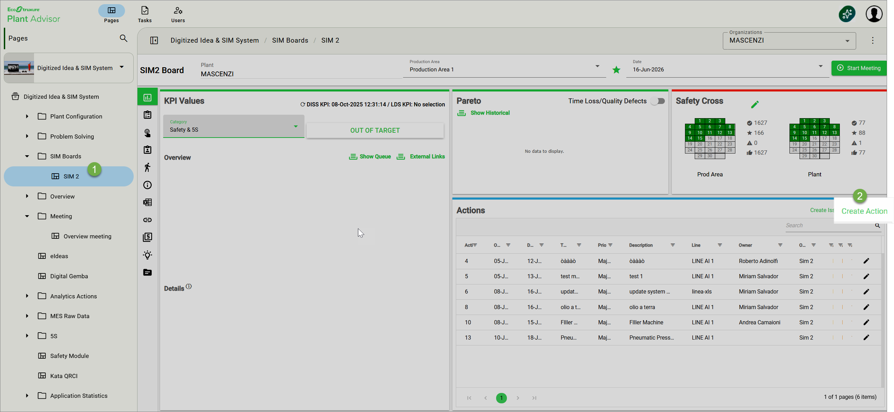

### Step 2 — Set the SIM context

Set the SIM context: Category (Safety, Quality, Delivery, Maintenance, Production, Engineering), Module (pre-filled with the Production Area from the originating board), Line. Source Tier and Target Tier are auto-selected from the originating SIM 2 Board; verify them before saving as the Source Tier becomes immutable once saved.

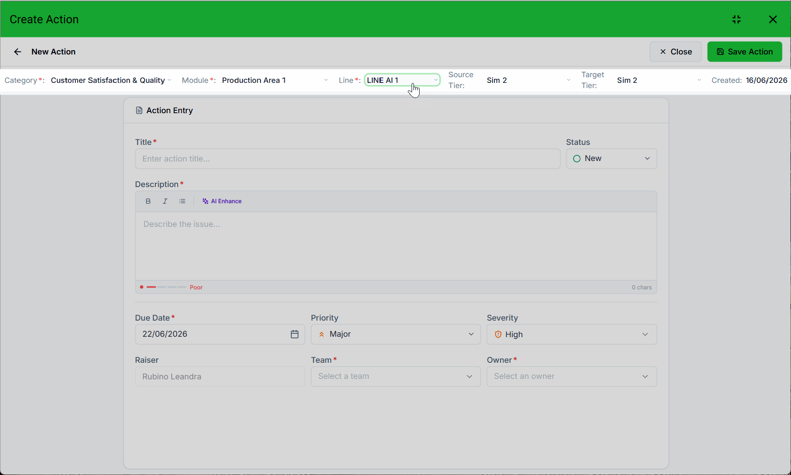

### Step 3 — Write the Title

Write a Title that identifies the problem (max 500 characters).

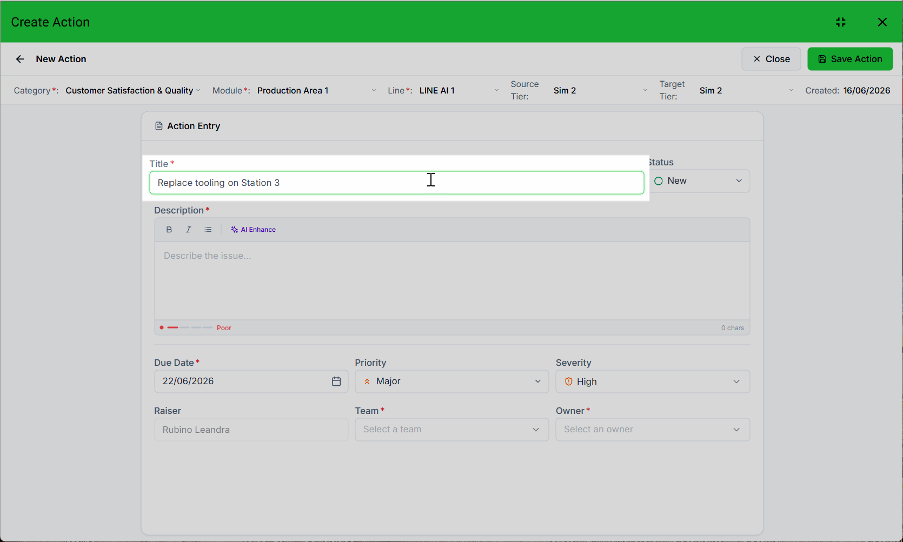

### Step 4 — Set the Status

Leave Status as "New" unless your local SIM process requires a different starting status.

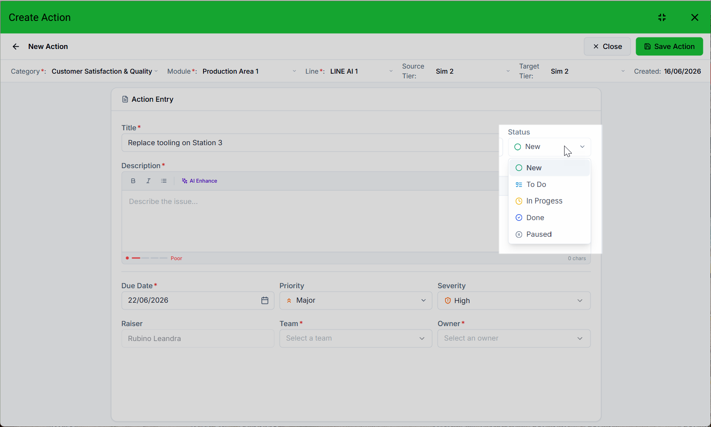

### Step 5 — Write the Description

Write the Description. Use bold / italic / lists for readability. Optionally click AI Enhance to improve clarity and watch the quality indicator give feedback as you type.

### Step 6 — Set the Due Date

Pick a Due Date — by default today + 7 days; past dates are not allowed.

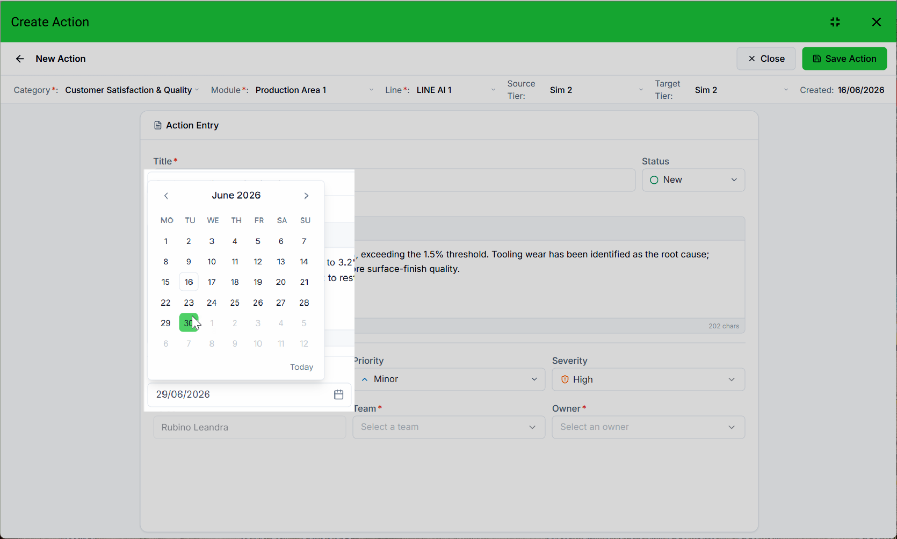

### Step 7 — Set Priority and Severity

Set Priority (Trivial / Minor / Major / Critical / Blocker) and Severity.

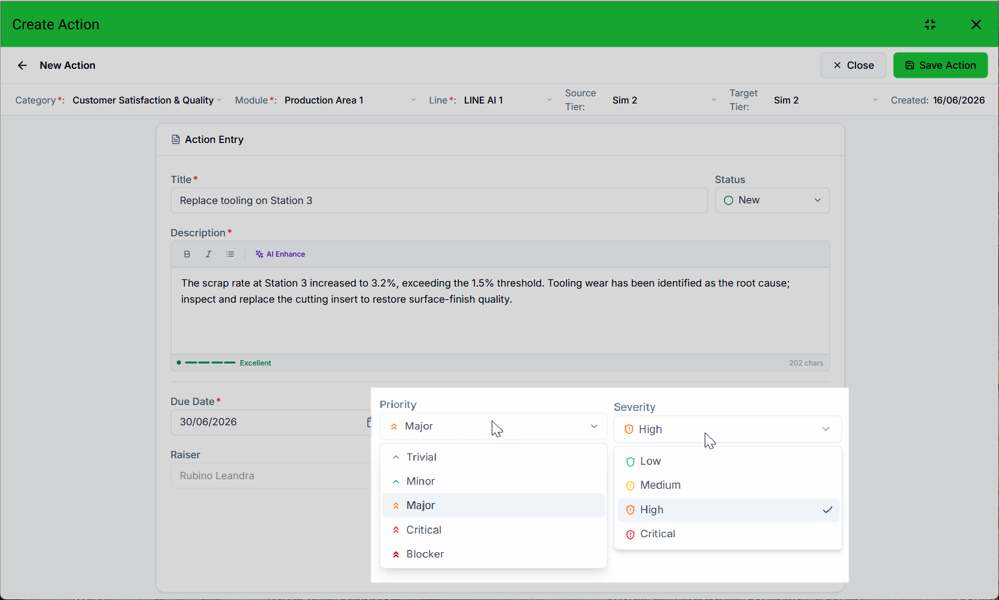

### Step 8 — Assign the Raiser, Team, and Owner

Confirm the Raiser (pre-filled with the current user; change only when registering on behalf of another).
Assign responsibility: at least one between Team and Owner must be set so the action has a clear accountable party on the SIM Board.

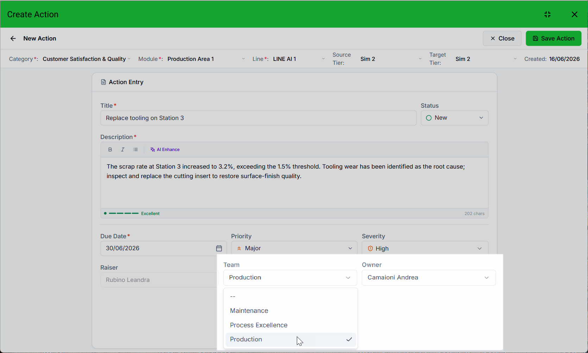

### Step 9 — Save the Action

Click Save Action. The green button activates only when all required fields are populated. Once saved, the action is visible on the SIM Board.

## 7.5  How to use it — Edit Action

### Step 1 — Open the action from the SIM Board

From the SIM Board, open the action you want to update.

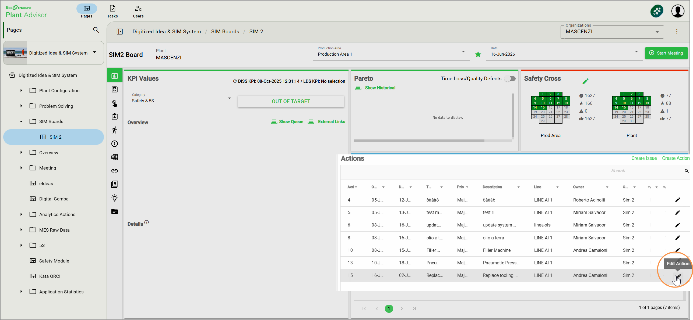

### Step 2 — Update the Entry Panel fields

Update the editable fields in the Entry Panel: Title, Status, Description (with AI Enhance and quality indicator), Due Date, Priority, Severity, Raiser, Team, Owner, Attachments.

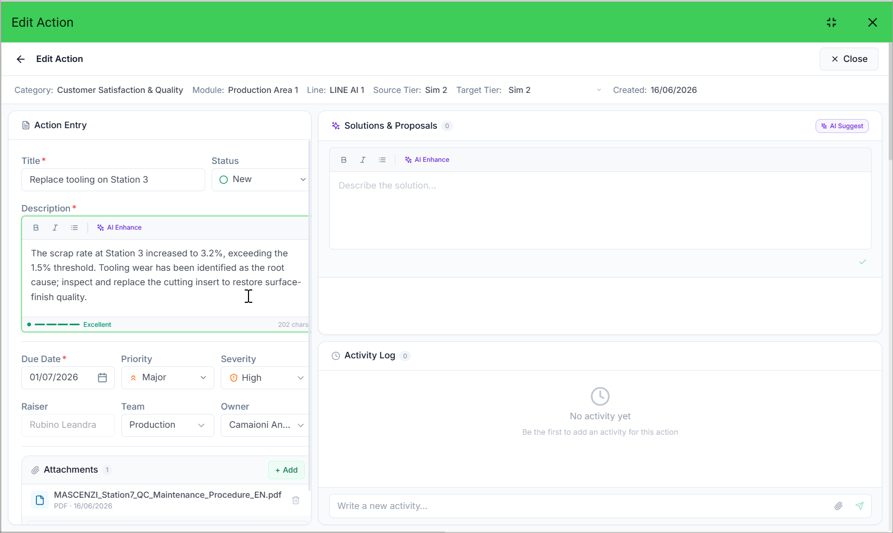

### Step 3 — Escalate to a higher SIM level if needed

Change the Target Tier in the context bar if the action needs to be escalated to a higher SIM level (it is the only context-bar field that remains editable after creation).

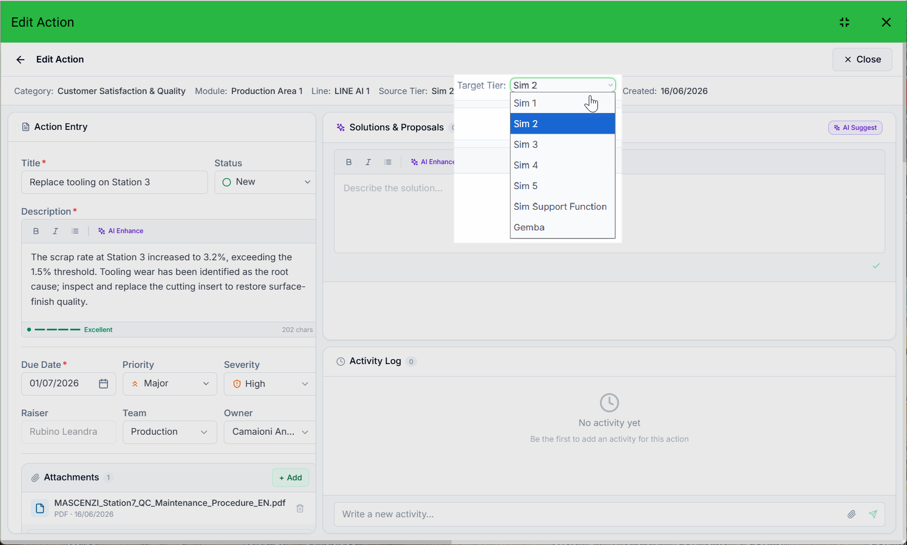

### Step 4 — Add or review Solutions & Proposals

In the Solutions & Proposals panel, type or paste the proposed solution or click AI Suggest to auto-generate solution proposals scored by relevance.

The proposed solutions were extracted from the document uploaded to DeepFind.

### Step 5 — Add notes to the Activity Log

Add notes to the Activity Log at the bottom of the panel; attach files via the paperclip icon if needed. The Activity Log is the SIM history of the action.

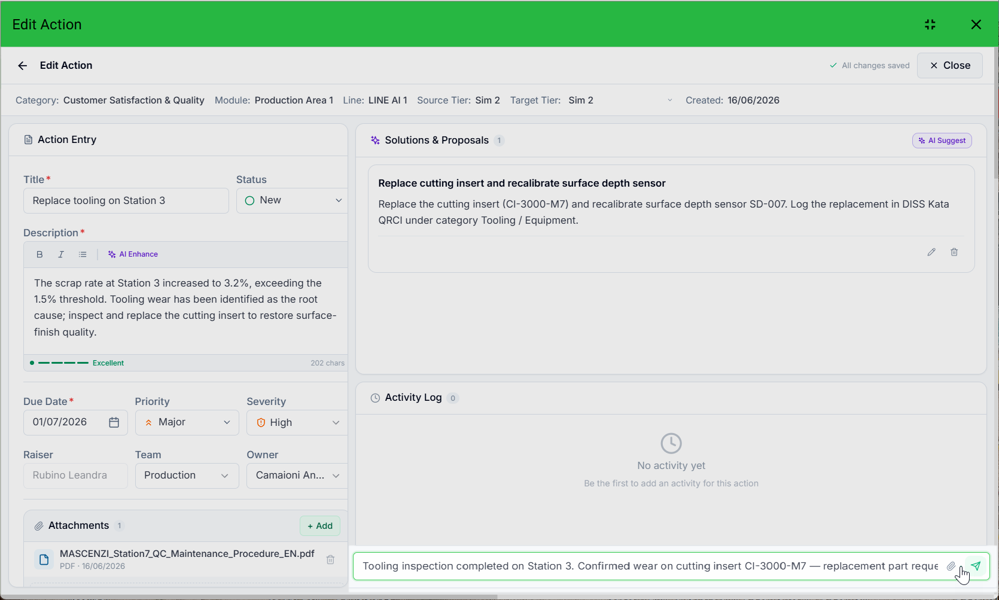

### Step 6 — Set the action to Done

Set the Status to "Done" only when the action is complete: "Done" locks the entire record.

.png)

## 7.6  Reading the result

Quality indicator on the Description — Poor / Fair / Good /Excellent— signals whether the text contains enough information to be acted on
AI Enhance rewrites the text for professional clarity; always review the result before saving
AI Suggest in Solutions ranks proposals by relevance percentage to the Description content
Email notifications are sent on status change, new Team/Owner assignment, 48-hour due-date warning, and overdue actions

## 7.7  Tips & known limits

Do not set Status to "Done" until the action is genuinely complete: it cannot be edited after that
If both Team and Owner are cleared, saving fails — always keep at least one assigned
Auto-save reverts the field on error: check the network connection if you see a save error message
AI Enhance and AI Suggest are assistive: the responsible Owner remains accountable for the final wording and the chosen solution
Escalation across SIM levels is performed by changing the Target Tier, not by creating a new action — this preserves the Activity Log history of the original problem
